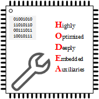

# hodea - Highly Optimized Deeply Embedded Auxiliaries

---

## About HODEA

HODEA is the umbrella for source code libraries and template projects
for deeply embedded systems, and related tools supporting the engineering
process in this field of application.

It comprises:

- [hodea-lib](https://hodea.github.io/hodea-lib/), a C++ source code
  library for deeply embedded, bare metal software.
- [hodea-stm32f0-project-template](https://hodea.github.io/hodea-stm32f0-project-template/),
   which serves as template for own project using
   [hodea-lib](https://github.com/hodea/hodea-lib)
- [hodea-review-minder](https://hodea.github.io/hodea-review-minder),
  Python 3 scripts assisting code reviews

## Source Code

The source code of this projects is hosted on [github](https://github.com/hodea).

